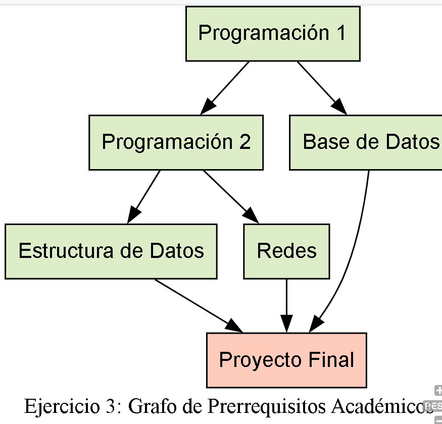

## Ejercicio 3: Grafo de Prerrequisitos Académicos
Se diseñó un modelo de **Grafo Dirigido Acíclico (DAG)** para representar la dependencia de materias (prerrequisitos) en la carrera de Ingeniería en Sistemas.

### Solución a los incisos:

**a) Descripción del problema:**
Modelado de las restricciones académicas donde ciertas materias deben ser aprobadas obligatoriamente antes de poder cursar las siguientes, culminando en el Proyecto Final.

**b) ¿Qué representa cada vértice?**
* Las asignaturas del plan de estudios (Ej. Programación 1, Base de Datos, Redes).

**c) ¿Qué representa cada arista?**
* La relación de **pre requisito**. Una flecha - indica que "A es requisito para cursar B".

**d) Diagrama del grafo:**

**e) Análisis del grafo:**
* **Conexidad:** Es un grafo conexo (en sentido débil).
* **Ciclos:** No tiene ciclos (es Acíclico), lo cual es consistente con la lógica temporal de aprobar materias pasadas para ver futuras.
* **Grados:** Las materias básicas tienen alto grado de salida (abren opciones) y las avanzadas alto grado de entrada (tienen muchos requisitos).

**f) Pregunta interesante:**
* **Pregunta:** ¿Cuál es la "ruta crítica" para llegar al Proyecto Final?
* **Respuesta:** La cadena más larga de materias secuenciales es: **Progra 1 → Progra 2 → Estructura de Datos → Proyecto Final**. Esto determina la duración mínima en semestres para graduarse.
